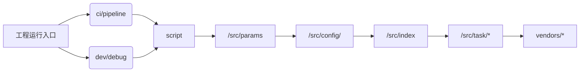

# 代码调用链说明

# 使用说明

## 关于 google doc 的调用

需要从 google 的开发者平台上导出 keys.json 关放于根目录下。
see more: https://console.cloud.google.com/projectselector2/apis/credentials?hl=zh-cn&supportedpurview=project&authuser=1&pli=1

## - 发团队周报 (邮件通道消息)

> ### 功能

    总结团队的工作内容，质量情况，排期，团队的 OKR 内容进行汇总

> ### 参数说明

| 任务类型 | 值                 |
| :------: | ------------------ |
| tasktype | team-weekly-report |
|   team   | lps                |

---

## - 发版计划消息（seatalk 通道消息）

> ### 功能

    将 starfish 的发版计划包括涉及到的业务模块，发送到指定的seatalk机器人中

> ### 参数说明

|    任务类型     | 值                  | 备注 |
| :-------------: | ------------------- | ---- |
|    tasktype     | weekly-release-plan |
|      team       | lps                 |
| seatalk_webhook | setalk 机器链接     |

---

## - 发送排期表到指定群（seatalk 通道消息）

> ### 功能

    将本周的人力安排情况（jira上的task/subtask安排）按 developer 汇总，输出到 google sheet。

> ### 参数说明

|    任务类型     | 值              | 备注 |
| :-------------: | --------------- | ---- |
|    tasktype     | weekly-schedule |
|      team       | lps             |
| seatalk_webhook | setalk 机器链接 |

## - 更新排期表

> ### 功能

    将本周的人力安排情况（jira上的task/subtask安排）按 developer 汇总，更新到 google sheet。* 无消息通知

> ### 参数说明

| 任务类型 | 值              | 备注 |
| :------: | --------------- | ---- |
| tasktype | update-schedule |
|   team   | lps             |

## - 团队人力视图（邮件通道消息）

> ### 功能

    生成团队人力视图报表

> ### 参数说明

| 任务类型 | 值                        | 备注 |
| :------: | ------------------------- | ---- |
| tasktype | team-weekly-schedule-gant |
|   team   | lps                       |

## - 团队人力视图+OKR 工作进展情况（邮件通道消息）

> ### 功能

    生成团队人力视图报表，OKR工作进展情况

> ### 参数说明

| 任务类型 | 值                    | 备注 |
| :------: | --------------------- | ---- |
| tasktype | team-schedule-keywork |
|   team   | lps                   |
